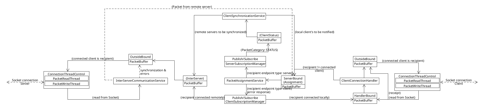

# VSY Project - Chat Server

The project is a chat server exclusively written in java. The server is failsafe, if two instances are started, connection oriented and state saving. All data is stored redundantly.
Client socket connections are handled on a per-thread basis up to a maximum of 10 connections, allowing authenticated clients to communicate with their contacts via text based messages. 
Besides the client connection handler threads, the server starts additional service threads:
* PacketAssignmentService: handles Packet routing using the publish-/subscribe pattern
* ClientStatusSynchronizationService: handles remotely connected client status changes and relays client status changes that are relevant for other connected clients
* InterServerCommunicationService: checks packages coming from another chat server
All connection points within the server are represented by a PacketBuffer that essentially is a BlockingDeque, enabling all main Packet processing entities to work asynchronously.
Parts of the application that are used by both the server and client side are a part of their own modules, e.g. Packet transmission through sockets, transmission related objects.
# Motivation

This is the server part of a project created to acquire an attestation required for admittance to the VSY (de: verteilte Systeme;en: distributed systems) exam at Niederrhein University of Applied Sciences.
The programming language Java was chosen for training purposes.
# Code style

The code style used is the Google's Java Style.
# Screenshots

# Tech/framework used

**Built with**
* [Jackson](https://github.com/FasterXML)
* [Log4J2](https://logging.apache.org/log4j/2.x/)  
 
**Built using**
* [Maven](https://maven.apache.org/)
****
# Tests

Most tests are written as black box tests, checking the server's correct behaviour for certain inputs. The tests are separated by packages, indicating the amount of servers that need to be manually started for the tests to work correctly.
# How to use?

The chat server, once built with maven, can be started by calling java -jar server-{version}-SNAPSHOT-jar-with-dependencies.jar.
# License

None at the moment.
